# 12G-SDI SFP Comparison

Some research I conducted after spending around $400 on a Blackmagic 12G-SDI SFP module and then discovering it works just fine when paired with a $34 FS 10G SFP+ module for networking equipment. These SFPs were installed in a pair of Blackmagic Optical Fiber 12G Miniconverters that support SDI in and out.

**Big caveat:** the connected equipment in my setup only supports 6G-SDI signals. However, other users on Reddit report being able to use the FS 10G SFPs with 12G-SDI signals, and as you will see below, both the BMD and FS SFPs use the same transceiver IC. The actual speed of a 12G-SDI signal is 11.88 Gbps.

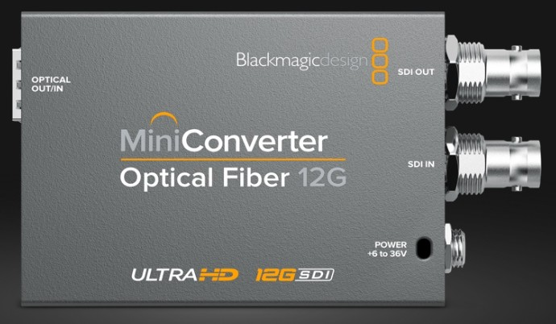

## Summary

| Make     | Model            | Transceiver IC     | Advertised Max Speed of IC | Cost  |
| -------- | ---------------- | ------------------ | -------------------------- | ----: |
| Neton    | NTX-8D32HJ-1310  | [MACOM M02193](https://www.macom.com/products/product-detail/M02193)  | 12.5 Gbps                  | ??    |
| PACBTECH | PAC-12G-20       | [MACOM M02193](https://www.macom.com/products/product-detail/M02193)  | 12.5 Gbps                  | ~$70  |
| BMD      | ADPT-12GBI/OPT   | [Gennum GN1157](https://www.semtech.com/products/signal-integrity/laser-drivers-transceivers/gn1157)      | 11.3 Gbps                  | ~$465 |
| FS       | SFP-10GLR-31     | [Gennum GN1157](https://www.semtech.com/products/signal-integrity/laser-drivers-transceivers/gn1157)      | 11.3 Gbps                  | ~$34  |

[^1]: Top marking partially obscured; identified by comparison with the Neton module's `02193G12 / 2029 MY` marking.

It can be seen in the teardown photos that the BMD SFP does have larger capacitors than the other SFPs, however the IC is not rated for the speeds that 12G-SDI requires.

## Neton NTX-8D32HJ-1310

MACOM M02193
Secondary IC: PA8Z2 (6-pin)

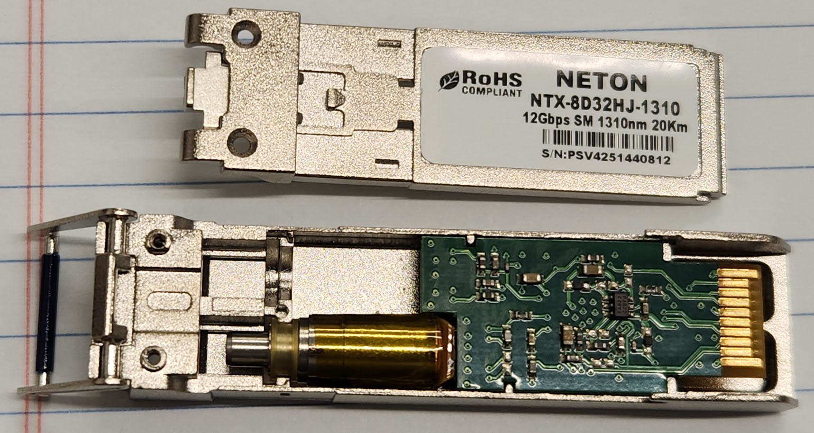

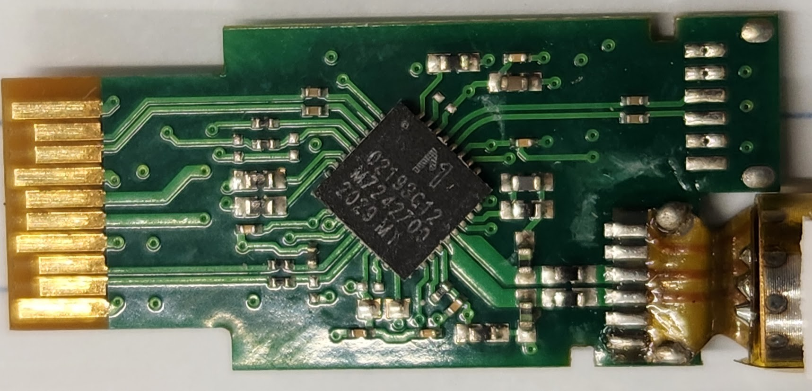

## PACBTECH PAC-12G-20

MACOM M02193

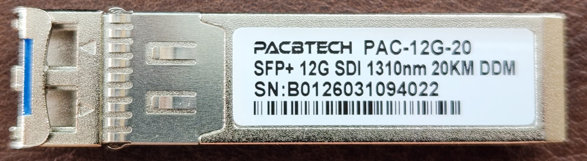

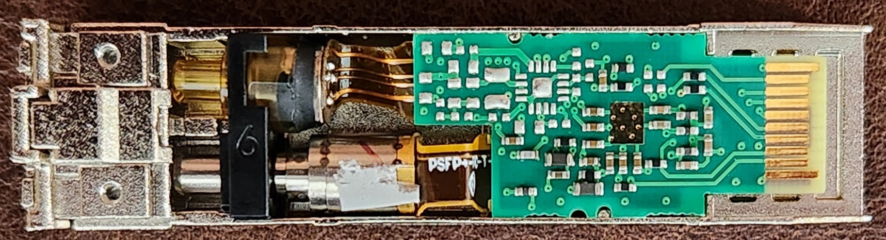

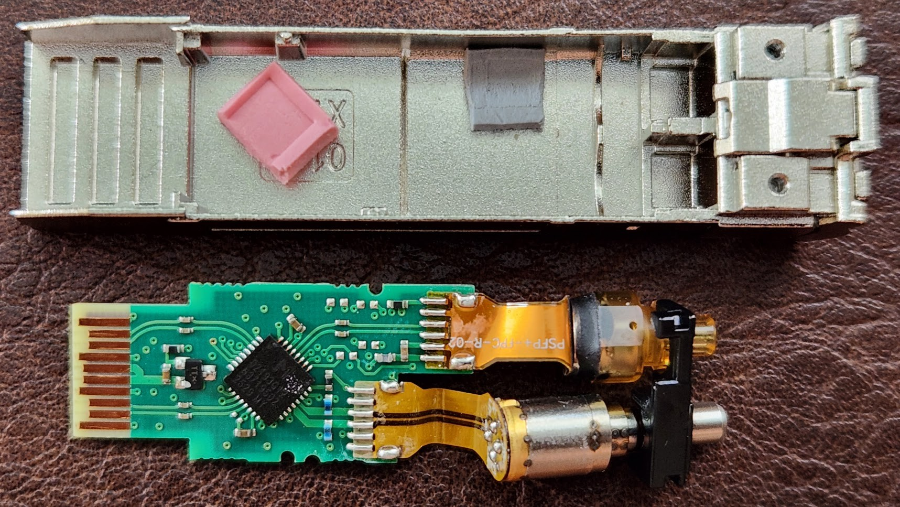

## FS SFP-10GLR-31

Gennum (now Semtech) GN1157 — LR transceiver chip. 
MCU: F850I

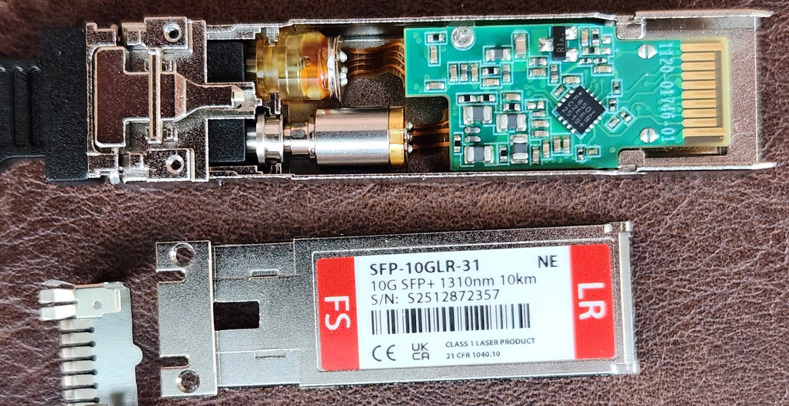

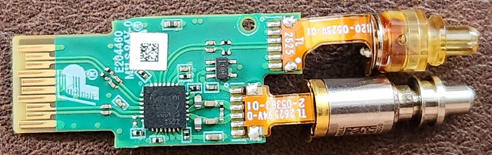

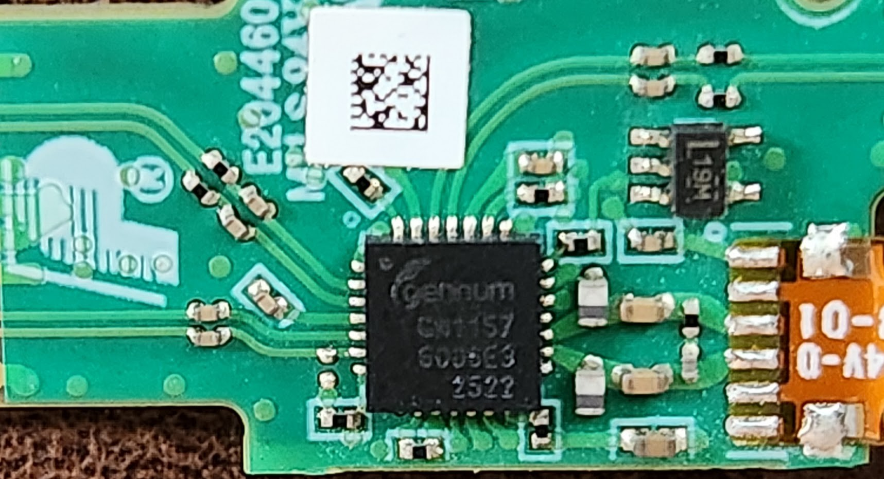

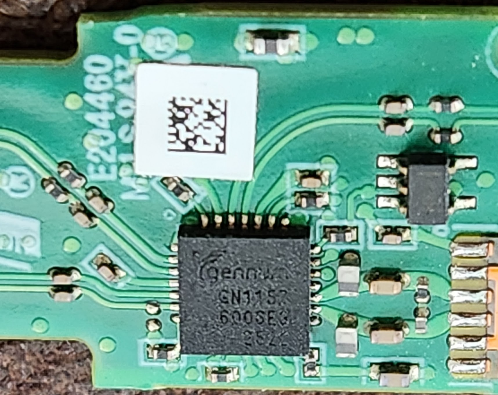

## Blackmagic ADPT-12GBI/OPT

Gennum (now Semtech) GN1157 —  LR transceiver chip. 
MCU: SIL F336

Has larger caps and inductors compared to the others.

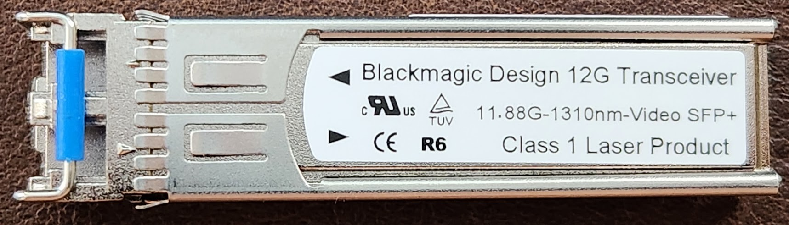

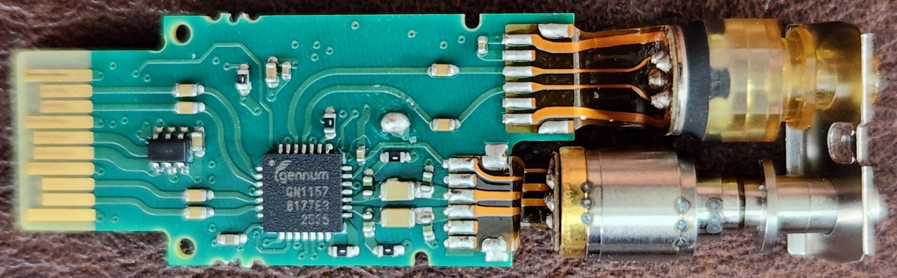

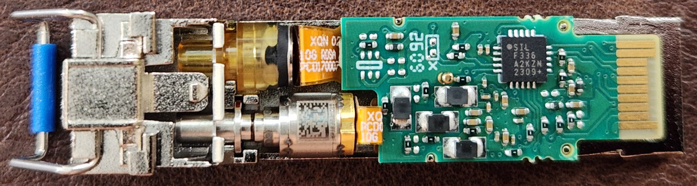

## BMD vs FS

Same transceiver IC, different board build. Larger caps and inductors on the BMD board.

| BMD | FS |
| :---: | :---: |
|  | 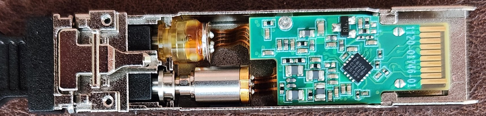 |
|  |  |
